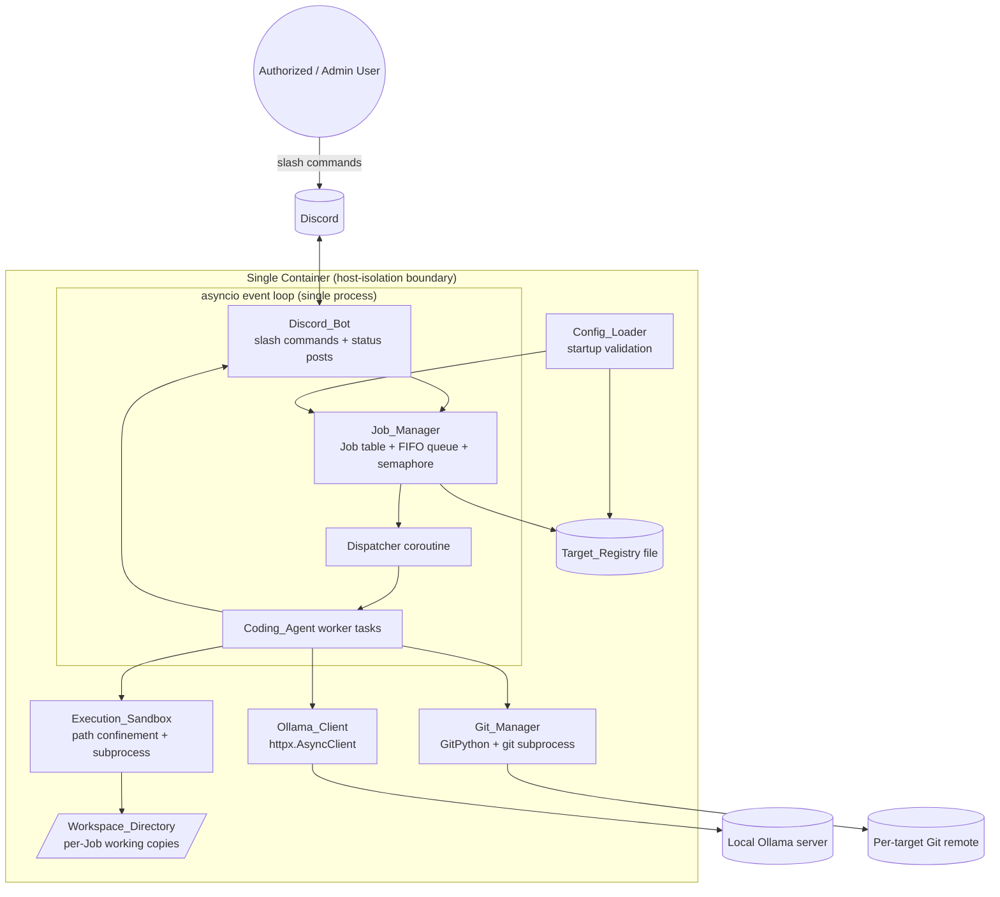
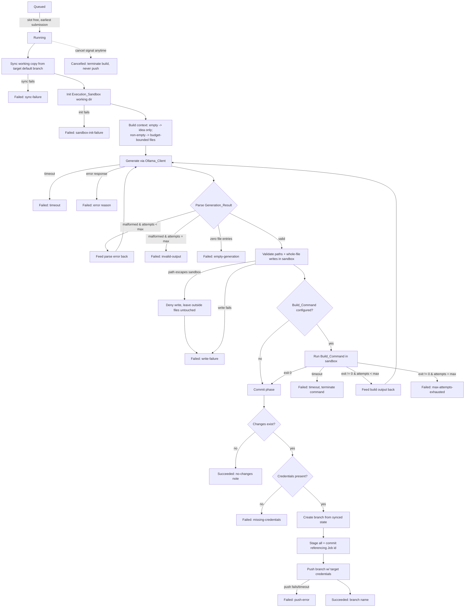
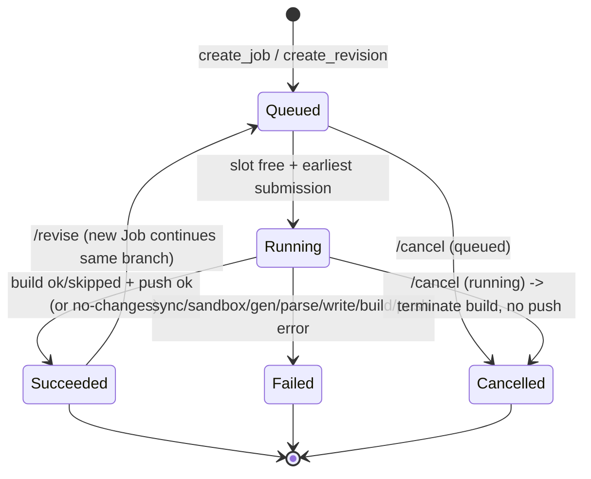

# Design Document

## Overview

The Discord-Ollama Coding Agent is a single, reusable Python application that turns coding ideas
submitted through Discord slash commands into committed, pushed Git branches. It uses a locally
hosted Ollama model for code generation, runs an iterative generate → write → build → fix loop, and
operates on a set of operator-configured `Registered_Targets` rather than a hardcoded codebase.

The entire system runs inside a **single container**. That container is the host-isolation boundary.
The system does **not** spin up a container per Job. Instead, each Job is confined to its own
per-Job working directory (the `Execution_Sandbox`) inside the shared container, where file writes
are path-confined, and build/test commands run under timeouts and resource bounds.

Key design pillars:

- **Generic over targets.** Target selection, build commands, Git remotes, branch schemes, and
  credentials all live in a persisted `Target_Registry`. The agent code carries no target-specific
  logic.
- **Local-only model.** All generation traffic goes to one configured `Ollama_Endpoint`. No idea
  text or generated content ever leaves that endpoint.
- **Isolation per Job, not per container.** Every Job gets a fresh, isolated working copy and a
  sandbox boundary. Multiple Jobs against the same target run concurrently without serialization.
- **In-memory Jobs, persisted Targets.** Jobs live only for the process lifetime; the
  `Target_Registry` survives restarts.
- **Fail-fast startup.** Misconfiguration (Ollama endpoint, build-attempt bounds, concurrency limit,
  context budget, allowed channels) terminates startup. Per-target misconfiguration excludes that
  target but does not block startup.

### Technology Choices

| Concern | Library | Justification |
| --- | --- | --- |
| Discord gateway + slash commands | **discord.py** (`discord.app_commands`) | Mature, asyncio-native, first-class application/slash command support, per-interaction channel/user metadata for the allowlist + channel checks. |
| Ollama HTTP calls | **httpx** (`AsyncClient`) | Async-native (integrates with discord.py's event loop), per-request timeouts, no blocking of the gateway. Chosen over `requests` (sync) and the official `ollama` client to keep one async HTTP stack and explicit control over timeouts/connectivity checks. |
| Config + data models + validation | **pydantic v2** | Declarative schema validation with precise error messages — ideal for the fail-fast startup validation (bounds checks on attempts, concurrency, context budget) and for parsing/validating the persisted registry. |
| Config file format | **YAML** (`pydantic-settings` + `PyYAML`) for system config; **JSON** for the writable `Target_Registry` | Human-authored system config benefits from YAML comments; the machine-appended registry is simpler/safer to rewrite atomically as JSON. |
| Git operations | **GitPython** for porcelain (branch, add, commit, push), with direct `git` subprocess fallback for fetch/auth env | High-level API for staging/commit/branch; credentials injected via per-target environment/askpass so secrets are never embedded in the registry. |
| Build/test execution | **asyncio subprocess** (`asyncio.create_subprocess_exec`) | Native async process control: non-blocking, supports timeout via `wait_for`, and clean termination for cancellation. |
| Property-based tests | **Hypothesis** | The de-facto Python PBT library; used for the correctness properties below. |
| Example/unit tests | **pytest** (+ `pytest-asyncio`) | Standard async-aware test runner. |

### Concurrency Model (recommended approach)

discord.py runs on a single `asyncio` event loop. Build/test commands are blocking external
processes, and some Git operations (GitPython) are blocking I/O. The recommended model:

- **One process, one asyncio event loop** hosts the Discord gateway, the Job queue, and the Job
  workers. This keeps shared state (Job table, queue, registry) single-threaded and lock-light.
- **Job concurrency** is bounded by an `asyncio.Semaphore` sized to the configured concurrency limit.
  A dispatcher coroutine pulls from a FIFO `asyncio.Queue` of Queued Jobs and starts a worker
  `asyncio.Task` per Job as slots free up.
- **Build/test commands** use `asyncio.create_subprocess_exec` so they never block the event loop and
  can be terminated cleanly (cancellation, timeout). Each command runs in a new process group so the
  whole tree can be killed.
- **Blocking Git calls** (GitPython porcelain) run via `asyncio.to_thread(...)` so the event loop
  stays responsive. Network `git fetch`/`git push` use timeouts.
- **Cancellation** combines an `asyncio.Event` (cooperative stop signal checked between phases) with
  active subprocess termination, plus `Task.cancel()` as a backstop.

This avoids multiprocessing complexity and inter-process state sync while still preventing the
blocking workloads (builds, Git network I/O) from stalling Discord interactions.



## Architecture

The system is layered so that transport (Discord), orchestration (Job/agent), and execution
(sandbox, Git, Ollama) are cleanly separable.

### Layers

1. **Transport layer — `Discord_Bot`.** Owns the Discord connection, registers the six slash
   commands, performs channel + authorization gating, validates command arguments, and renders all
   outbound status/reply messages. It never touches the filesystem or Git directly; it delegates to
   the `Job_Manager`.
2. **Orchestration layer — `Job_Manager` + `Coding_Agent`.** The `Job_Manager` owns the in-memory
   Job table, the FIFO queue, the concurrency semaphore, the dispatcher, and Job lifecycle
   transitions. Each Job is executed by a `Coding_Agent` worker that runs the iterative build loop
   and emits lifecycle events that the `Discord_Bot` translates into messages.
3. **Execution layer — `Ollama_Client`, `Execution_Sandbox`, `Git_Manager`.** Stateless services
   invoked by the `Coding_Agent`. `Ollama_Client` talks to the model; `Execution_Sandbox` confines
   writes and runs build commands; `Git_Manager` performs sync/branch/commit/push with per-target
   credentials.
4. **Configuration layer — `Config_Loader` + `Target_Registry`.** Loads and validates system config
   at startup (fail-fast), loads/validates the persisted registry (per-target exclusion), and
   provides atomic persistence when admins add targets.

### Startup Sequence

```mermaid
sequenceDiagram
    participant Main
    participant Cfg as Config_Loader
    participant Reg as Target_Registry
    participant OC as Ollama_Client
    participant Bot as Discord_Bot

    Main->>Cfg: load + validate system config
    alt invalid system config (endpoint/attempts/concurrency/budget/channels)
        Cfg-->>Main: raise StartupError
        Main->>Main: log reason, exit non-zero (no ready state)
    end
    Main->>Reg: load persisted registry
    Reg->>Reg: validate each target; exclude invalid ones (log)
    Reg-->>Main: usable Registered_Targets
    Main->>OC: connectivity check (GET /api/tags, model present?)
    alt model not confirmed within 10s
        OC-->>Main: degraded flag set (jobs rejected w/ unavailable-model)
    end
    Main->>Bot: connect gateway, register slash commands
    Bot-->>Main: ready
```

### Job Execution Flow (iterative build loop)



## Components and Interfaces

Interfaces below are described at design level (Python-flavored signatures). Concrete async
annotations (`async def`) are shown where the operation performs I/O.

### Config_Loader

Responsible for reading and validating all system-level configuration at startup. Validation is
fail-fast: any invalid global value raises a `StartupError` that prevents the ready state.

```python
class ConfigLoader:
    def load(self, path: Path) -> SystemConfig: ...
        # Reads YAML, constructs SystemConfig (pydantic). Raises StartupError on:
        #   - missing/empty Ollama endpoint or model            (Req 2.2)
        #   - syntactically invalid Ollama URL                  (Req 2.5)
        #   - max_build_attempts not int in [1, 10]             (Req 4.9)
        #   - concurrency_limit not int in [1, 100]             (Req 7.6)
        #   - context budget file count not int in [1, 1000]    (Req 4.14)
        #   - context budget bytes not int in [1024, 67108864]  (Req 4.14)
        #   - allowed_channels empty                            (Req 13.5)
```

### Target_Registry

Owns the persisted set of `Registered_Targets`. Loads + validates on startup (excluding invalid
targets), resolves targets by name, and atomically appends admin-added targets.

```python
class TargetRegistry:
    def load(self, path: Path, workspace_dir: Path) -> RegistryLoadResult: ...
        # Returns usable targets + excluded targets with reasons.   (Req 12.1-12.3)
    def get(self, name: str) -> RegisteredTarget | None: ...        # (Req 1.1, 12.4)
    def names(self) -> list[str]: ...                               # (Req 9.1, 9.2)
    def add(self, target: RegisteredTarget) -> None: ...
        # Validates name + path containment, persists atomically.   (Req 10.1, 10.3-10.6)
    def exists(self, name: str) -> bool: ...                        # (Req 10.5)
```

Path containment uses `Path.resolve()` on both the workspace and the candidate, then checks that the
resolved candidate is relative to the resolved workspace. This rejects `..` traversal and resolved
symlinks (Req 10.3). Persistence uses write-to-temp + atomic `os.replace` to avoid corruption.

### Discord_Bot

Owns the gateway, slash command registration, gating, argument validation, and message rendering.

```python
class DiscordBot:
    # Slash commands: /build /status /cancel /targets /addtarget /revise
    async def on_build(self, itx, target: str | None, idea: str): ...
    async def on_status(self, itx, job_id: str): ...
    async def on_cancel(self, itx, job_id: str): ...
    async def on_targets(self, itx): ...
    async def on_addtarget(self, itx, name: str, path: str): ...   # admin allowlist
    async def on_revise(self, itx, job_id: str, feedback: str): ...

    # Gating applied to EVERY command before processing:
    def _gate(self, itx, *, admin: bool) -> GateResult: ...
        # 1) channel in Allowed_Channels?  else not-permitted-here  (Req 13.1, 13.3)
        # 2) user in (admin allowlist if admin else user allowlist)? (Req 1.4, 8.1, 6.6, 9.3, 10.2, 11.5)
        # Both must pass.                                            (Req 13.2, 13.3)

    # Lifecycle event sink (called by Job_Manager):
    async def on_job_event(self, event: JobEvent): ...
        # Renders started/succeeded/failed messages; retries delivery up to 3x. (Req 6.1-6.3, 6.7)
```

All replies are produced within the 5-second interaction window (Req 1.3-1.8, 6.1-6.6, 8.x, 13.1).
Channel + user gating is centralized in `_gate` so every command enforces both checks identically.

### Job_Manager

Owns Job identity, the in-memory Job table, the FIFO queue, the concurrency semaphore, the
dispatcher, and all Job_Status transitions. Jobs are **not** persisted across restarts.

```python
class JobManager:
    def create_job(self, target: RegisteredTarget, idea: str, channel_id: int,
                   user_id: int) -> Job: ...
        # Generates unique id = "{target.name}-{unique_suffix}"; status=Queued; enqueues. (Req 1.1, 7.1)
    def create_revision(self, base_job: Job, feedback: str,
                        channel_id: int, user_id: int) -> Job: ...
        # New Job continuing base_job.branch_name; status=Queued.    (Req 11.1, 11.10)
    def get(self, job_id: str) -> Job | None: ...                   # (Req 6.4, 6.5, 8.2, 11.6)
    async def cancel(self, job_id: str) -> CancelOutcome: ...
        # Queued -> remove + Cancelled; Running -> signal stop + kill build + Cancelled;
        # terminal -> reject.                                        (Req 8.3, 8.4, 8.6)
    async def _dispatch_loop(self): ...
        # While queued & slot free: pop earliest -> Running -> spawn worker task. (Req 7.3-7.5)
```

Job id uniqueness uses a monotonic counter (or UUID suffix) combined with the target name; consumed
ids are never reused even after a Job terminates (Req 7.1).

### Coding_Agent

Executes a single Job's lifecycle: sync, sandbox init, context build, the generate/write/build/fix
loop, then commit/push via `Git_Manager`. Emits `JobEvent`s on transitions.

```python
class CodingAgent:
    async def run(self, job: Job, cancel: CancellationToken) -> None: ...
        # Orchestrates the full flow in the Job Execution Flow diagram.
    def _build_context(self, working_copy: Path, budget: ContextBudget) -> list[FileEntry]: ...
        # Empty copy -> [];  non-empty -> budget-bounded subset.     (Req 3.1, 3.2, 3.4, 3.5)
    def _build_revision_context(self, branch_files, feedback) -> GenerationRequest: ...
        # Loads existing branch contents + feedback.                 (Req 11.2)
```

The agent checks the `CancellationToken` between phases and aborts cleanly without committing or
pushing (Req 8.5).

### Ollama_Client

Stateless HTTP client for the configured endpoint. Performs the startup connectivity check and
per-Job generation calls; enforces the generation timeout.

```python
class OllamaClient:
    async def check_connectivity(self) -> ConnectivityResult: ...
        # GET {endpoint}/api/tags; confirm configured model present, within 10s. (Req 2.3, 2.4)
    async def generate(self, request: GenerationRequest) -> RawCompletion: ...
        # POST {endpoint}/api/chat with structured-output `format` = Generation_Result JSON schema.
        # Sends ONLY to the configured endpoint.                     (Req 3.3, 3.6)
        # Raises GenerationTimeout after configured timeout (30-600s, default 120). (Req 3.10)
        # Raises OllamaError on error response.                      (Req 3.11)
```

The client requests structured output by passing a JSON schema (derived from the
`Generation_Result` pydantic model via `model_json_schema()`) in the Ollama `format` field, which
constrains the model to emit schema-shaped JSON. Parsing/validation of the completion into a
`Generation_Result` is performed by the `Coding_Agent` so that parse failures can be fed back as a
retry (Req 3.7-3.9).

### Execution_Sandbox

Per-Job working-directory boundary inside the container. Confines all writes to the Job working dir
and runs build/test commands under timeout with terminable process groups.

```python
class ExecutionSandbox:
    def init_working_dir(self, job: Job, source: Path) -> Path: ...
        # Creates isolated working copy root; raises SandboxInitError on failure. (Req 4.10, 7.2)
    def resolve_within(self, relative_path: str) -> Path: ...
        # Resolves against working dir; raises PathEscapeError if outside.        (Req 4.2)
    def write_file(self, relative_path: str, content: str) -> None: ...
        # Path-validated whole-file write; raises WriteError on failure.          (Req 4.1, 4.11)
    async def run_command(self, command: str, cancel: CancellationToken,
                          timeout_s: int) -> CommandResult: ...
        # asyncio subprocess in working dir; captures output (cap 1 MiB);
        # terminates on timeout or cancel.                                        (Req 4.3, 4.6, 4.8)
```

Path confinement: `resolve_within` joins the relative path to the working-dir root, calls
`resolve()`, and verifies the result is relative to the resolved working-dir root. Any escape
(absolute paths, `..`, symlink escape) is denied and **no** file outside the working dir is touched
(Req 4.2). Build output capture is truncated to the configured 1 MiB maximum (Req 4.6).

### Git_Manager

Performs per-Job Git operations using the Job's target's remote, branch scheme, and credentials.

```python
class GitManager:
    async def sync_default_branch(self, target, working_copy: Path) -> SyncResult: ...
        # Fetch + reset working copy to target's default branch from remote.  (Req 4.12, 4.13)
    def branch_name_for(self, job: Job, target) -> str: ...
        # Derives from Job id via target's branch-naming scheme; includes target name. (Req 5.1)
    async def commit_and_push(self, job, target, working_copy: Path) -> PushResult: ...
        # If no changes -> no-changes outcome (Req 5.6).
        # Else: create branch, stage all (add/mod/del), commit referencing Job id,
        #       push with target credentials, honoring push timeout.   (Req 5.1-5.5, 5.8)
        # Missing credentials -> missing-credentials, no push.         (Req 5.7)
    async def commit_and_push_revision(self, job, target, working_copy: Path) -> PushResult: ...
        # Adds new commits to the existing branch and pushes.          (Req 11.4)
```

Credentials are resolved at runtime from a secret reference (env var name or secret path stored in
the registry) — never the secret value itself. They are injected via a per-invocation environment
(e.g., a credential helper / `GIT_ASKPASS` or token-in-URL constructed in memory) and never written
to the registry or logs (Req 5.4, 5.7). `commit_and_push` refuses to run for a Cancelled Job
(Req 5.9).

## Data Models

All models are pydantic v2 classes. Validation bounds are enforced at construction so that startup
and registry loading fail fast with precise messages.

### SystemConfig

```python
class ContextBudget(BaseModel):
    max_file_count: int       # validated 1..1000              (Req 4.14)
    max_total_bytes: int      # validated 1024..67108864       (Req 4.14)

class OllamaConfig(BaseModel):
    endpoint_url: HttpUrl     # must be http/https              (Req 2.1, 2.5)
    model: str                # non-empty                       (Req 2.1, 2.2)
    generation_timeout_s: int = 120     # validated 30..600     (Req 3.10)

class SystemConfig(BaseModel):
    ollama: OllamaConfig
    workspace_dir: Path
    max_build_attempts: int = 3         # validated 1..10       (Req 4.9)
    concurrency_limit: int              # validated 1..100      (Req 7.6)
    execution_timeout_s: int = 300      # validated 1..3600     (Req 4.8)
    context_budget: ContextBudget
    allowed_channels: list[int]         # non-empty             (Req 13.4, 13.5)
    authorized_users: list[int]         # build/status/cancel/targets/revise
    admin_users: list[int]              # addtarget only        (Req 10.2)
    default_target: str | None = None   # Default_Target        (Req 1.2, 1.7)
    max_idea_length: int | None = None  # optional cap          (Req 1.8)
    push_timeout_s: int = 120           # push timeout          (Req 5.5)
    build_output_cap_bytes: int = 1_048_576  # 1 MiB            (Req 4.6)
```

### RegisteredTarget

```python
class RegisteredTarget(BaseModel):
    name: str                 # unique, 1..64 non-whitespace chars (Req 10.6)
    directory_path: Path      # must resolve inside Workspace_Directory (Req 10.1, 10.3)
    build_command: str | None = None        # optional          (Req 4.3, 4.7)
    repo_remote: str          # target's Git remote URL          (Req 5.3, 12.1)
    default_branch: str = "main"             # synced before each Job (Req 4.12)
    branch_scheme: str = "{job_id}"          # branch naming; includes target name via job_id (Req 5.1)
    credentials_ref: str      # secret REFERENCE (env var / secret path), NOT the secret (Req 5.4, 5.7)
```

Required-for-usability fields are `name`, `directory_path` (resolvable inside the workspace), and
`repo_remote`. A target missing any of these is excluded at startup with a logged reason
(Req 12.1-12.3).

### Job

```python
class JobStatus(str, Enum):
    QUEUED = "Queued"; RUNNING = "Running"
    SUCCEEDED = "Succeeded"; FAILED = "Failed"; CANCELLED = "Cancelled"

class Job(BaseModel):
    id: str                   # "{target_name}-{unique}"; unique, never reused (Req 7.1)
    target_name: str
    idea: str
    status: JobStatus = JobStatus.QUEUED
    submitted_at: datetime    # FIFO ordering key                (Req 7.4)
    channel_id: int           # originating channel for replies  (Req 6.1-6.3)
    user_id: int
    attempts_completed: int = 0
    branch_name: str | None = None          # retained for /revise (Req 11.1, 11.9)
    failure_reason: str | None = None        # populated on Failed
    result_note: str | None = None           # e.g., no-changes / branch pushed
    is_revision: bool = False
    base_job_id: str | None = None           # set for revisions  (Req 11.1)
```

Terminal states: `SUCCEEDED`, `FAILED`, `CANCELLED`. `branch_name` is what `/revise` checks for
retention (Req 11.9).

### Generation Models

```python
class FileEntry(BaseModel):
    path: str                 # relative path; validated against sandbox at write time (Req 3.3, 4.2)
    content: str              # full intended file content (whole-file write)          (Req 3.3, 4.1)

class GenerationResult(BaseModel):
    files: list[FileEntry]    # zero or more; zero -> empty-generation failure          (Req 3.7, 3.12)

class GenerationRequest(BaseModel):
    idea: str
    context_files: list[FileEntry] = []      # budget-bounded or empty (Req 3.1, 3.2, 3.4, 3.5)
    prior_error: str | None = None           # parse error or build output for retries (Req 3.8, 4.5)
    feedback: str | None = None              # for revisions          (Req 11.2)
```

The JSON schema passed to Ollama's `format` parameter is `GenerationResult.model_json_schema()`,
constraining the model toward the expected structured shape; final validation is still performed in
Python so malformed output is retried (Req 3.8) or fails at max attempts (Req 3.9).

### Job Lifecycle State Machine



## Correctness Properties

*A property is a characteristic or behavior that should hold true across all valid executions of a
system — essentially, a formal statement about what the system should do. Properties serve as the
bridge between human-readable specifications and machine-verifiable correctness guarantees.*

The following properties were derived from the acceptance criteria via the prework analysis above.
Redundant criteria were consolidated (for example, all per-command authorization and channel checks
collapse into a single gating conjunction property). Criteria classified as INTEGRATION or SMOKE are
covered by the Testing Strategy rather than as properties.

### Property 1: Command gating requires both channel and user authorization

*For any* command among `/build`, `/status`, `/cancel`, `/targets`, `/addtarget`, `/revise`, *for any*
invoking user, and *for any* originating channel, the command is acted upon **if and only if** the
channel is among `Allowed_Channels` AND the user is authorized for that command (the admin allowlist
for `/addtarget`, the user allowlist for all others); otherwise no state changes and a denial/not-permitted
reply is produced.

**Validates: Requirements 1.4, 6.6, 8.1, 9.3, 10.2, 11.5, 13.1, 13.2, 13.3**

### Property 2: Whitespace-only required inputs are rejected

*For any* string composed entirely of Unicode whitespace supplied as a `/build` idea or a `/revise`
feedback argument, the System creates no Job/revision and replies requesting non-empty input.

**Validates: Requirements 1.5, 11.8**

### Property 3: Idea length cap is enforced

*For any* configured maximum idea length and *for any* idea string, the System creates a Job **if and
only if** the idea's length measured in Unicode characters does not exceed the configured maximum;
otherwise it replies with a too-long message and creates no Job.

**Validates: Requirements 1.8**

### Property 4: Job identity contains the target name, is unique, and is never reused

*For any* sequence of Job creations (including after other Jobs reach terminal states), every Job
identifier contains its associated target's name, and all identifiers are pairwise unique with no
identifier ever reused.

**Validates: Requirements 1.3, 7.1**

### Property 5: Working copies are isolated per Job

*For any* set of concurrently tracked Jobs — including multiple Jobs against the same Registered_Target —
the working-copy root assigned to each Job is distinct from every other Job's working-copy root.

**Validates: Requirements 1.9, 7.2, 7.7**

### Property 6: Running Jobs never exceed the concurrency limit

*For any* interleaving of Job submissions and completions, the number of Jobs in status Running never
exceeds the configured concurrency limit, and every terminal transition frees exactly one slot.

**Validates: Requirements 7.3, 7.5, 7.7**

### Property 7: Dispatch order is FIFO by submission time

*For any* set of Queued Jobs, whenever a running slot becomes available the Job selected to transition
to Running is the Queued Job with the earliest submission time.

**Validates: Requirements 7.4**

### Property 8: Startup configuration validation accepts exactly in-bounds values

*For any* configuration value, startup succeeds with respect to that value **if and only if** it is in
bounds: `max_build_attempts` an integer in [1, 10]; `concurrency_limit` an integer in [1, 100];
context-budget file count an integer in [1, 1000]; context-budget total bytes an integer in
[1024, 67108864]; and `Allowed_Channels` non-empty. Any out-of-bounds, non-integer, or missing value
terminates startup without a ready state and emits an error identifying the offending value.

**Validates: Requirements 4.9, 4.14, 7.6, 13.5**

### Property 9: Context selection stays within the configured budget

*For any* set of existing project files and *for any* valid `Context_Budget`, the selection of files
included as generation context contains at most the budget's maximum file count and a combined size of
at most the budget's maximum total bytes, and generation proceeds with that subset.

**Validates: Requirements 3.4, 3.5**

### Property 10: Context presence follows working-copy emptiness

*For any* Job, the first generation request includes existing-file context **if and only if** the Job's
working copy is non-empty; an empty working copy yields a request with no existing-file context.

**Validates: Requirements 3.1, 3.2**

### Property 11: Sandbox confines all writes to the Job working directory

*For any* file entry path in a Generation_Result, the write is permitted **if and only if** the path
resolves to a location inside the Job's Execution_Sandbox working directory; any path resolving outside
(via absolute paths, `..` traversal, or symlinks) is denied and no file outside the working directory
is modified.

**Validates: Requirements 4.2**

### Property 12: Target registration is confined to the Workspace_Directory

*For any* candidate directory path supplied to `/addtarget`, the target is registered **only if** the
path resolves to a location inside the `Workspace_Directory`; paths escaping the workspace (via `..`,
absolute paths, or symlinks) are rejected and not registered.

**Validates: Requirements 10.3**

### Property 13: File writes round-trip within the sandbox

*For any* set of in-bounds file entries written to a Job's working copy, reading each written path back
yields exactly the content that was written, with later writes to the same path overwriting earlier
content.

**Validates: Requirements 4.1**

### Property 14: Retry is attempt-bounded and feeds prior errors back

*For any* sequence of failing attempts (malformed Generation_Result or non-zero build exit), while the
number of completed attempts is less than `Maximum_Build_Attempts` a new attempt begins carrying the
prior error (parse error or build output) as feedback; when completed attempts equal
`Maximum_Build_Attempts` the Job transitions to Failed with the corresponding reason (invalid-output or
max-attempts-exhausted), and the total number of attempts never exceeds `Maximum_Build_Attempts`.

**Validates: Requirements 3.8, 3.9, 4.5, 4.6**

### Property 15: Captured build output is capped at 1 MiB

*For any* build command output, the failure reason recorded for a max-attempts-exhausted Job contains at
most 1 MiB (1,048,576 bytes) of captured output.

**Validates: Requirements 4.6**

### Property 16: Cancelled Jobs never stage, commit, or push

*For any* Job that is in or transitions to status Cancelled, the Git_Manager performs no staging, commit,
or push for that Job, regardless of any files produced before cancellation.

**Validates: Requirements 5.9, 8.4, 8.5**

### Property 17: Missing credentials prevent any push

*For any* Job whose Registered_Target's configured Git credentials reference resolves to no credentials,
the Job transitions to Failed with a missing-credentials reason and no push is attempted.

**Validates: Requirements 5.7**

### Property 18: No file changes yields Succeeded with a no-changes note and no push

*For any* Job whose working copy has no differences from its synced default-branch state, the Job
transitions to Succeeded with a no-changes note and the commit and push steps are skipped.

**Validates: Requirements 5.6**

### Property 19: Branch and commit reference the target and Job identifier

*For any* Job, the branch name derived from the Job identifier via the target's branch-naming scheme
contains the associated target's name, and the commit message created for that Job references the Job
identifier.

**Validates: Requirements 5.1, 5.2**

### Property 20: Status messages carry the Job identifier and correct state information

*For any* Job, the rendered started/succeeded/failed message and the `/status` reply contain the Job
identifier and the corresponding state information: Succeeded includes the pushed branch name or a
no-changes note; Failed includes the recorded failure reason; `/status` includes the current Job_Status.

**Validates: Requirements 6.2, 6.3, 6.4, 11.11**

### Property 21: Not-found replies reference the queried identifier

*For any* `/status`, `/cancel`, or `/revise` invocation referencing a Job identifier not present in the
Job table, the reply is a not-found message that includes the queried identifier and no state changes.

**Validates: Requirements 6.5, 8.2, 11.6**

### Property 22: Status delivery retries are bounded

*For any* sequence of delivery failures when posting a status message, the System attempts delivery at
most 3 retries; if all retries are exhausted it records a delivery-failure reason in the operator log
and makes no further attempts.

**Validates: Requirements 6.7**

### Property 23: Registry validation partitions targets and unregistered builds are rejected

*For any* loaded Target_Registry, a Registered_Target is included in the usable set **if and only if**
its required per-target configuration (resolvable in-workspace directory path and Target_Repository
remote) is present; excluded targets are logged with name and missing value, and a `/build` against any
name not in the usable set is rejected as not-registered.

**Validates: Requirements 1.6, 12.2, 12.3, 12.4**

### Property 24: Target registration persists across reloads

*For any* valid target added via `/addtarget`, reloading the Target_Registry from disk yields a registry
that contains the added target with the same configuration.

**Validates: Requirements 10.1**

### Property 25: Duplicate target names are rejected without clobbering

*For any* `/addtarget` whose name matches an existing Registered_Target name, the registration is rejected
and the existing target's configuration is left unchanged.

**Validates: Requirements 10.5**

### Property 26: Target name validation enforces length and non-whitespace

*For any* candidate target name, registration is accepted with respect to the name **if and only if** the
name contains at least one non-whitespace character and its length measured in Unicode characters does not
exceed 64; otherwise it is rejected as invalid.

**Validates: Requirements 10.6**

### Property 27: Generation_Result round-trips through serialization

*For any* valid Generation_Result, serializing it to the structured wire format and parsing it back
yields an equivalent Generation_Result (same ordered file entries with identical paths and content).

**Validates: Requirements 3.7**

### Property 28: Zero-file generations fail as empty-generation

*For any* completion that parses into a Generation_Result containing zero file entries, the Job
transitions to Failed with an empty-generation reason; any completion with at least one file entry
proceeds to the write step.

**Validates: Requirements 3.12**

### Property 29: Generation traffic targets only the configured endpoint

*For any* generation request, the only network destination contacted by the Ollama_Client is the
configured `Ollama_Endpoint`; no idea text or generated content is transmitted to any other destination.

**Validates: Requirements 3.6**

### Property 30: Cancellation outcome depends only on current status

*For any* Job, a `/cancel` invocation removes it from the queue and sets Cancelled when it is Queued,
signals stop / terminates the build and sets Cancelled when it is Running, and is rejected with a
terminal-state message when it is Succeeded, Failed, or Cancelled (leaving status unchanged).

**Validates: Requirements 8.3, 8.6**

### Property 31: Revision eligibility and same-branch continuation

*For any* `/revise` invocation, a revision is created **if and only if** the referenced Job exists, is in
status Succeeded, still retains its branch information, and the feedback contains a non-whitespace
character; when created, the revision continues on the referenced Job's branch and loads that branch's
contents together with the feedback as generation context. Otherwise no revision is created and the
appropriate rejection message is returned.

**Validates: Requirements 11.1, 11.2, 11.7, 11.9**

## Error Handling

Errors are categorized by where they occur and how the System responds. Two overarching rules:
(1) global misconfiguration fails fast at startup; (2) per-Job errors transition the Job to a terminal
state with a specific recorded reason that is surfaced to Discord and the operator log.

### Startup Errors (fail-fast, no ready state)

| Condition | Response | Requirement |
| --- | --- | --- |
| Missing/empty Ollama endpoint or model | `StartupError`, log identifying value, exit | 2.2 |
| Ollama endpoint not a valid http/https URL | `StartupError`, log identifying value, exit | 2.5 |
| `max_build_attempts` not int in [1, 10] | `StartupError`, log identifying value, exit | 4.9 |
| `concurrency_limit` not int in [1, 100] | `StartupError`, log identifying value, exit | 7.6 |
| Context budget file count / bytes out of bounds | `StartupError`, log identifying value, exit | 4.14 |
| No `Allowed_Channels` configured | `StartupError`, log identifying message, exit | 13.5 |

### Degraded-but-running

| Condition | Response | Requirement |
| --- | --- | --- |
| Connectivity check fails to confirm model within 10s | Log reason; reject new Jobs with unavailable-model message until a later check confirms the model | 2.3, 2.4 |

### Registry Errors (exclude, do not block startup)

| Condition | Response | Requirement |
| --- | --- | --- |
| Target missing required config (path/remote) | Exclude from usable targets; log name + missing value | 12.2 |

### Per-Job Failure Reasons (terminal `Failed`)

| Reason code | Trigger | Requirement |
| --- | --- | --- |
| `sync-failure` | Fetch/reset of default branch from remote fails | 4.13 |
| `sandbox-init-failure` | Working directory cannot be initialized | 4.10 |
| `timeout` (generation) | No model response within generation timeout (30–600s) | 3.10 |
| `error` (model) | Ollama returns an error response | 3.11 |
| `invalid-output` | Malformed Generation_Result at max attempts | 3.9 |
| `empty-generation` | Parsed result has zero file entries | 3.12 |
| `write-failure` | Writing a file entry into the sandbox fails | 4.11 |
| `timeout` (build) | Build/test command exceeds execution timeout; command terminated | 4.8 |
| `max-attempts-exhausted` | Build still failing at max attempts (output capped at 1 MiB) | 4.6 |
| `missing-credentials` | Target credentials reference resolves to nothing; no push attempted | 5.7 |
| `push-error` | Push fails or exceeds push timeout | 5.5 |

### Transient Discord Delivery Errors

Status posts that fail are retried up to 3 times; exhausted retries record a delivery-failure reason in
the operator log (Req 6.7). Retries use the originating channel captured on the Job.

### Cancellation Handling

Cancellation is cooperative plus forceful: a `CancellationToken` (`asyncio.Event`) is checked between
phases, the active build/test subprocess (and its process group) is terminated, and the worker task is
cancelled as a backstop. A cancelled Job never stages, commits, or pushes (Req 8.5, 5.9). Cancelling a
terminal Job is rejected (Req 8.6).

## Testing Strategy

The feature mixes pure logic (path confinement, budget bounding, identity, gating, validation, parsing)
with I/O and external services (Discord gateway, Ollama HTTP, Git network, subprocess execution). It is
therefore well-suited to a **dual testing approach**: property-based tests for the pure-logic
correctness properties, and example/integration/smoke tests for the I/O and external behavior.

### Property-Based Testing (Hypothesis)

PBT IS appropriate here because the system has substantial pure-logic surfaces with large input spaces
and clear universal properties (round-trips, invariants, partitions, conjunctions). Requirements:

- Use **Hypothesis**; do not hand-roll generators-as-tests or implement PBT from scratch.
- Each correctness property (Properties 1–31 above) is implemented by a **single** property-based test.
- Each property test runs a **minimum of 100 iterations** (Hypothesis `max_examples >= 100`).
- Each property test is tagged with a comment referencing its design property, in the format:
  **Feature: discord-ollama-coding-agent, Property {number}: {property_text}**
- External dependencies are mocked inside property tests so that 100+ iterations stay cheap:
  - Ollama: an in-memory fake `OllamaClient` returning scripted/structured completions.
  - Git: an in-memory or temp-dir local repository (no network) for branch/commit/no-diff logic;
    network push/fetch is left to integration tests.
  - Subprocess builds: a stub command runner returning scripted exit codes/output.
- Generators of note:
  - Path generator producing both in-bounds relative paths and escaping paths (`..`, absolute,
    symlink-backed) for Properties 11 and 12.
  - Unicode string generator including whitespace-only and multi-byte/emoji strings for Properties 2,
    3, and 26.
  - Job-submission/completion interleaving generator (stateful) for Properties 6 and 7
    (Hypothesis `RuleBasedStateMachine` is recommended for the concurrency invariant).
  - File-set + budget generator for Property 9.

### Example / Unit Tests (pytest)

For criteria classified EXAMPLE or EDGE_CASE — specific branches and error paths that do not benefit
from randomized input:

- `/build` with omitted target and no Default_Target (1.7).
- Missing/empty Ollama URL or model; invalid URL scheme (2.2, 2.5).
- Generation request carries the Generation_Result JSON schema in the `format` field (3.3).
- Build branch decisions: exit 0 proceeds to commit (4.4); no Build_Command skips build (4.7).
- Forced sandbox-init failure (4.10) and write failure (4.11).
- Nonexistent / non-directory registration path (10.4).
- Empty registry `/targets` message (9.2).

### Integration Tests (1–3 representative examples each)

For criteria that exercise external services or infrastructure wiring, where input variation does not
add value and 100 iterations would be costly:

- Ollama connectivity check against a mocked `/api/tags` (model present / absent / recovery) (2.3, 2.4).
- Generation timeout via a delayed mock response (3.10); model error response mapping (3.11).
- Build command actually run in the sandbox working directory with correct cwd (4.3); build/test
  timeout terminates a sleeping command (4.8).
- Default-branch sync from a local fixture remote (4.12) and sync-failure path (4.13).
- Push to a fixture remote with per-target credentials resolved from a reference (5.3, 5.4, 5.8);
  push failure/timeout (5.5).
- Revision adds commits to the existing branch and pushes (11.4).
- Started message posted on Running transition within timing budget (6.1).

### Smoke Tests (single execution)

- Config load reads Ollama endpoint/model (2.1) and Allowed_Channels (13.4).

## Requirements Traceability

Every requirement is addressed by the design. The table maps each requirement to the components and the
property/test that validate it (P = correctness Property number above; otherwise the test class).

| Req | Design coverage | Validation |
| --- | --- | --- |
| 1.1, 1.2 | Discord_Bot `_gate` + Job_Manager `create_job` (default-target routing) | P1, P4; example |
| 1.3 | Job_Manager id generation; Discord_Bot reply | P4; timing via integration |
| 1.4 | Discord_Bot `_gate` | P1 |
| 1.5 | Discord_Bot `/build` arg validation | P2 |
| 1.6 | Target_Registry `get` over usable set | P23 |
| 1.7 | Default_Target absence branch | example |
| 1.8 | Idea length validation (Unicode) | P3 |
| 1.9 | Execution_Sandbox per-Job working copy | P5 |
| 2.1 | Config_Loader | smoke |
| 2.2, 2.5 | Config_Loader validation | edge/example |
| 2.3, 2.4 | Ollama_Client `check_connectivity`; degraded mode | integration |
| 3.1, 3.2 | Coding_Agent `_build_context` | P10 |
| 3.3 | Ollama_Client schema in `format` | example |
| 3.4, 3.5 | Coding_Agent budget-bounded selection | P9 |
| 3.6 | Ollama_Client single-endpoint egress | P29 |
| 3.7 | Generation_Result parsing | P27 |
| 3.8, 3.9 | Coding_Agent retry-on-parse-failure | P14 |
| 3.10, 3.11 | Ollama_Client timeout/error mapping | integration |
| 3.12 | Coding_Agent empty-generation check | P28 |
| 4.1 | Execution_Sandbox `write_file` | P13 |
| 4.2 | Execution_Sandbox `resolve_within` | P11 |
| 4.3, 4.4, 4.7 | Execution_Sandbox `run_command`; build branches | integration/example |
| 4.5, 4.6 | Coding_Agent build retry + output cap | P14, P15 |
| 4.8 | Execution_Sandbox timeout termination | integration |
| 4.9 | Config_Loader bounds | P8 |
| 4.10, 4.11 | Coding_Agent error paths | example |
| 4.12, 4.13 | Git_Manager `sync_default_branch` | integration |
| 4.14 | Config_Loader context-budget bounds | P8 |
| 5.1, 5.2 | Git_Manager `branch_name_for` / commit | P19 |
| 5.3, 5.4, 5.5, 5.8 | Git_Manager `commit_and_push` | integration |
| 5.6 | Git_Manager no-diff outcome | P18 |
| 5.7 | Git_Manager credential resolution | P17 |
| 5.9 | Git_Manager cancelled guard | P16 |
| 6.1 | Discord_Bot `on_job_event` (started) | integration |
| 6.2, 6.3, 6.4 | Discord_Bot message rendering | P20 |
| 6.5 | Discord_Bot not-found reply | P21 |
| 6.6 | Discord_Bot `_gate` | P1 |
| 6.7 | Discord_Bot delivery retry | P22 |
| 7.1 | Job_Manager id generation | P4 |
| 7.2, 7.7 | Execution_Sandbox isolation | P5 |
| 7.3, 7.5 | Job_Manager semaphore/slot accounting | P6 |
| 7.4 | Job_Manager FIFO dispatcher | P7 |
| 7.6 | Config_Loader bounds | P8 |
| 8.1 | Discord_Bot `_gate` | P1 |
| 8.2 | Job_Manager not-found | P21 |
| 8.3, 8.6 | Job_Manager `cancel` | P30 |
| 8.4 | Job_Manager cancel running + terminate | P16, P30 |
| 8.5 | Git_Manager cancelled guard | P16 |
| 9.1 | Target_Registry `names` | P23 (usable set) |
| 9.2 | Discord_Bot empty-registry message | example |
| 9.3 | Discord_Bot `_gate` | P1 |
| 10.1 | Target_Registry `add` + atomic persist | P24 |
| 10.2 | Discord_Bot `_gate` (admin) | P1 |
| 10.3 | Target_Registry workspace containment | P12 |
| 10.4 | Target_Registry existence check | edge |
| 10.5 | Target_Registry duplicate guard | P25 |
| 10.6 | Target_Registry name validation | P26 |
| 11.1, 11.2, 11.7, 11.9 | Job_Manager `create_revision`; Coding_Agent revision context | P31 |
| 11.3 | Coding_Agent shared build loop | P14 |
| 11.4 | Git_Manager `commit_and_push_revision` | integration |
| 11.5 | Discord_Bot `_gate` | P1 |
| 11.6 | Job_Manager not-found | P21 |
| 11.8 | Discord_Bot feedback validation | P2 |
| 11.10 | Job_Manager concurrency/isolation | P5, P6 |
| 11.11 | Discord_Bot message rendering | P20 |
| 12.1, 12.2, 12.3, 12.4 | Target_Registry `load` partition | P23 |
| 13.1, 13.2, 13.3 | Discord_Bot `_gate` conjunction | P1 |
| 13.4 | Config_Loader | smoke |
| 13.5 | Config_Loader channel validation | P8 |

## Security Considerations

- **Host isolation = the container.** The single container is the isolation boundary between the System
  and the host. The System does not create a container per Job; the per-Job `Execution_Sandbox` is a
  working-directory boundary inside the container.
- **Sandbox path confinement.** All Generation_Result writes are resolved and verified to lie within the
  Job's working directory before writing; absolute paths, `..` traversal, and symlink escapes are denied
  with no modification of files outside the working directory (Property 11). The same containment logic
  guards `/addtarget` path registration against the `Workspace_Directory` (Property 12).
- **Credential handling.** Per-target Git credentials are stored as *references* (env var name or secret
  path) in the registry, never as secret values. They are resolved at push time and injected via a
  per-invocation environment/credential helper, never written to the registry, never logged, and never
  surfaced in Discord messages.
- **Authorization and channel gating.** Every command requires both an allowed channel and an authorized
  user; `/addtarget` requires the separate admin allowlist. The conjunction is centralized so no command
  can bypass either check (Property 1). At least one Allowed_Channel is required at startup (Property 8).
- **Execution bounds.** Build/test commands run under a configurable timeout (1–3600s) with terminable
  process groups; captured output is capped at 1 MiB to bound memory and message size.
- **Accepted network risk.** The container has outbound network access so builds can fetch dependencies.
  This is an explicitly accepted risk: model-generated build commands run with network egress available.
  The primary controls are the user allowlist, the admin allowlist, and the Allowed_Channels set — not
  egress filtering. This should be documented for operators, and targets should be trusted projects.
- **Local-only model traffic.** Idea text and generated content are sent only to the configured
  `Ollama_Endpoint` and to no third-party LLM API (Property 29).

## Design Decisions and Rationale

- **Single asyncio process over multiprocessing.** discord.py is asyncio-native; keeping the Job table,
  queue, and registry on one event loop avoids cross-process state synchronization. Blocking work
  (builds, GitPython) is offloaded to subprocesses / `asyncio.to_thread` so the gateway stays responsive.
- **httpx over the official ollama client / requests.** A single async HTTP stack with explicit
  per-request timeouts supports both the 10s connectivity check and the 30–600s generation timeout
  without blocking the loop.
- **Structured outputs via Ollama `format` + Python-side validation.** Passing the Generation_Result JSON
  schema constrains the model, but final validation stays in Python so malformed output can be retried as
  a normal attempt rather than crashing the Job.
- **Whole-file writes over diffs.** Whole-file content (per the requirements) avoids fragile patch
  application against model output and makes path confinement the only write-time concern.
- **JSON registry with atomic replace; YAML system config.** The machine-appended registry is safest to
  rewrite atomically as JSON; the human-authored system config benefits from YAML comments.
- **In-memory Jobs, persisted Targets.** Matches the requirement that Jobs do not survive restarts while
  the Target_Registry does; also bounds memory and simplifies recovery (no half-finished Jobs to resume).
